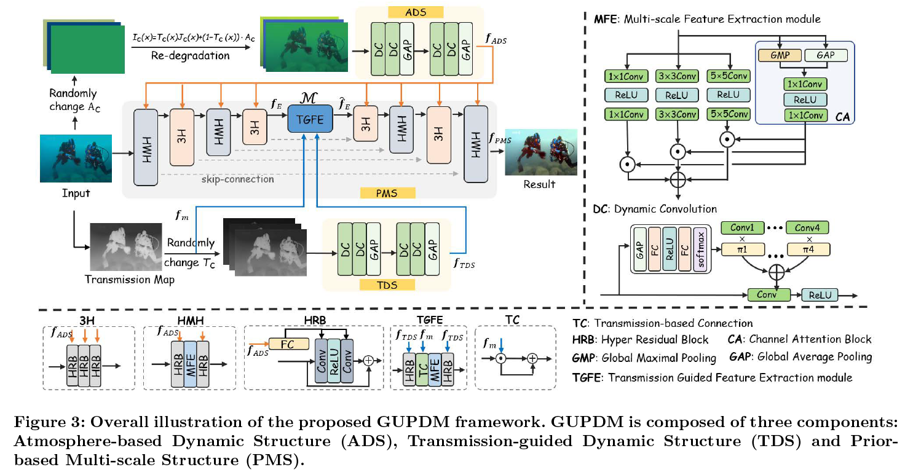

# A Generalized Physical-knowledge-guided Dynamic Model for Underwater Image Enhancement

This repository is the official PyTorch implementation of A Generalized Physical-knowledge-guided Dynamic Model for Underwater Image Enhancement.
[Link: Arxiv](https://arxiv.org/abs/2308.05447#).



##Introduction
Underwater images often suffer from color distortion and low contrast resulting in various image types, due to the scattering and absorption of light by water. While it is difficult to obtain high-quality paired training samples with a generalized model. To tackle these challenges, we design a Generalized Underwater image enhancement method via a Physical-knowledge guided Dynamic Model (short for GUPDM), consisting of three parts: Atmosphere-based Dynamic Structure (ADS), Transmission-guided Dynamic Structure (TDS), and Prior-based Multi-scale Structure (PMS). In particular, to cover complex underwater scenes, this study changes the global atmosphere light and the transmission to simulate various underwater image types (e.g., the underwater image color ranging from yellow to blue) through the formation model. We then design ADS and TDS that use dynamic convolutions to adaptively extract prior information from underwater images and generate parameters for PMS. These two modules enable the network to select appropriate parameters for various water types adaptively. Besides, the multi-scale feature extraction module in PMS uses convolution blocks with different kernel sizes and obtains weights for each feature map via channel attention block and fuses them to boost the receptive field of the network.


## Requirements

### Dependency

Our code is based on the PyTorch library
* PyTorch 1.5.11+

Run the following command line to install all the dependencies


    pip install -r requirements.txt

### Dataset

If you need to train our GUPDM from scratch, you need to download our dataset from [LSUI](https://pan.baidu.com/s/1rtHIwEmVp9BZDYJ_kb5Wfg) .


## Training
### Dataset File structure
To train/test the dataset should be defined as follows:

```
[main folder]─┐
              ├─► train ──┐
              │           ├─► input ─────┐
              ├─► test    │              ├─► *.png
                          ├─► gt         │
                          │              │
                          │              │
                          ├─► input_map  │
                          │              │
                          │              └─► *.png
                          └─► input.txt


```

- The structure for the valid/test folder is the same as train.
- 'input_map' is for transmission map. UDCP can be used to estimate.


Train command:
```shell
python train.py       \
        --train_data_dir [path to data]   \
        --checkpoint [SavePath] \
        --device [cpu/cuda]     \        
        --category [output image path]  \
        --weight_out [output weight path]
```
## Testing

```shell
python test_test2.py                          \
        --val_data_dir [path to data]         \ 
        --val_filename [data filename]                          
        --weights [path to weights file (*.pth)]  \ 
        --device [cpu/cuda]                       \
```


## Cite

[GUPDM paper](https://arxiv.org/abs/2206.05970):

```
@misc{mu2023generalized,
  title={A Generalized Physical-knowledge-guided Dynamic Model for Underwater Image Enhancement},  
  author = {Mu, Pan and Xu, Hanning and Liu, Zheyuan and Wang, Zheng and Chan, Sixian and Bai, Cong},  
  eprint={2206.05970},
  publisher = {arXiv},  
  year = {2023},  
}
```
